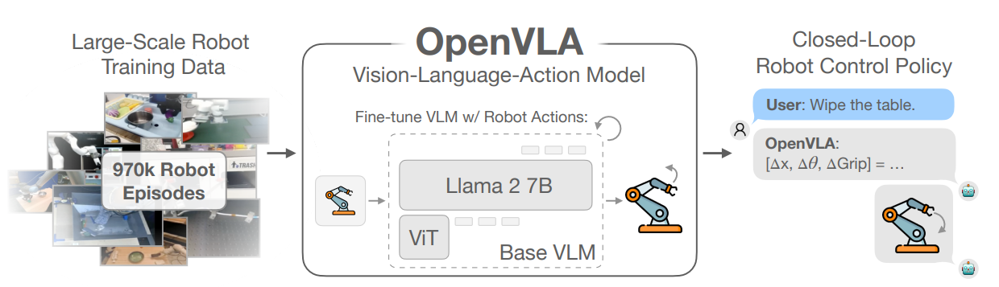

# OpenVLA: Unified Policy for Embodied Instruction Following

**OpenVLA** is a vision-language-action (VLA) model that generalizes across robotic tasks, embodiments, and environments by training a single policy using large-scale imitation learning. The framework unifies visual and language inputs and maps them directly to continuous robot actions using a multimodal transformer policy.

---

 <!-- Replace with your actual path -->

---

## 🧠 Model Structure

OpenVLA consists of a fine-tuned **Vision-Language Model (VLM)** and a robot control head, enabling closed-loop policy execution:

- **Language Encoder:** LLaMA 2-7B (or similar) encodes free-form natural language instructions.
- **Visual Encoder:** ViT encodes RGB-D frames from the robot's onboard camera.
- **Multimodal Transformer Policy:** Combines instruction, visual, and proprioceptive inputs to predict the next robot action in the form of continuous control signals \([Δx, Δθ, ΔGrip]\).

The architecture supports **both Cartesian space and joint space** actions, adapting to different robot embodiments.

---

## 🎯 Core Concepts

### 1. Imitation Learning from Large-Scale Data

OpenVLA is trained using **970,000+ robot demonstrations** collected from multiple sources including RoboTasks, RT-1, EgoVLA, and VLMaps.

This enables:
- Generalization across **tasks**
- Transferability across **robots**
- Robustness across **environments**

### 2. Unified Policy

Instead of building a separate policy for each environment or task, OpenVLA learns a **single universal policy** that generalizes across:
- Multiple robot arms and mobile platforms
- Real and simulated environments
- A wide range of manipulation and navigation tasks

### 3. Fine-tuning with Action Supervision

OpenVLA fine-tunes a pretrained vision-language model (e.g., ViT + LLaMA2) using robot action data.

This resembles **LLM fine-tuning**, but with a key difference:
- Instead of generating text, the model is trained to generate **robot control signals**
- Loss is computed over the predicted actions (not tokens), enabling direct grounding of language in robot behavior

This method maintains general language understanding while aligning output with the robot control space.

---

## 🧪 Capabilities

- **Instruction following** with free-form, open-vocabulary text
- **Embodiment-agnostic execution** (across robot types and sensor configurations)
- **Online and closed-loop control** with real-time adaptation
- **Zero-shot generalization** to new tasks and phrasing variations

---

## 📁 Contents

This folder includes:

- `README.md` — Overview and model summary
- `deploy_details.md` (coming soon) — Setup instructions and environment configuration
- `results/` videos, and visual results from replicated experiments

---

## 📎 Resources

- 📄 [Paper on arXiv](https://arxiv.org/abs/2312.00759)
- 🌐 [Project Page](https://openvla.github.io) *(if released)*
- 🔬 Related datasets: RoboTasks, RT-1, EgoVLA, VLMaps

---
