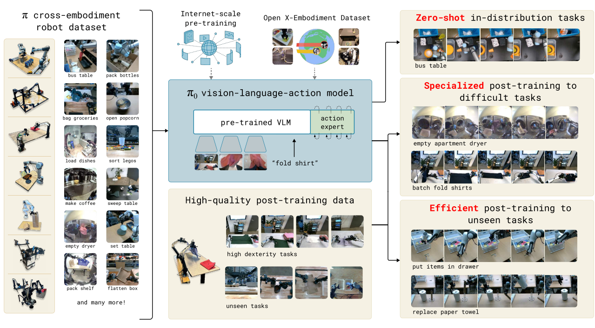
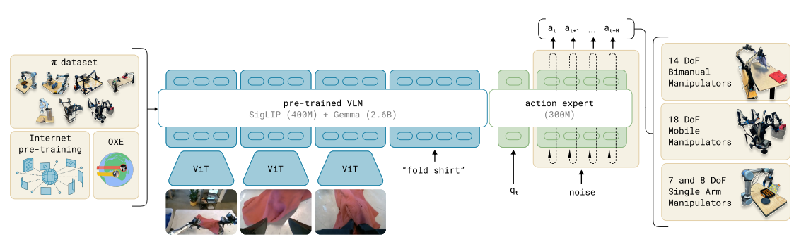

# Pi0: Open-Vocabulary Robotic Manipulation with Zero Supervision

Pi0 is a vision-language-action (VLA) policy designed for open-world robotic manipulation without requiring expert demonstrations or reward engineering. By leveraging foundation models and internet-scale data, Pi0 can generalize to unseen tasks and novel language instructions across a wide range of scenes.

 <!-- Replace with your actual path -->


## 🧠 Core Ideas

- **Policy Learning from VLM Feedback Alone**  
  Pi0 learns general manipulation policies without any ground-truth rewards or human demonstrations. Instead, it relies entirely on feedback from a pretrained vision-language model (VLM), such as CLIP, to supervise policy training.

- **Learning in Large-Scale Simulated 3D Environments**  
  Pi0 performs trial-and-error learning in procedurally generated 3D scenes with assets drawn from datasets like Objaverse, HM3D, and CC3D, enabling massive-scale and diverse pretraining.

- **Language-Conditioned Manipulation**  
  Pi0 supports open-vocabulary instructions and interprets them through a frozen text encoder. It synthesizes language, image, and scene features to generate grounded manipulation behaviors.

- **Self-Improving, Reward-Free Learning**  
  By leveraging its own execution logs and VLM-based evaluations, Pi0 autonomously selects successful rollouts to imitate, improving its policy in a bootstrapped fashion.


## 📚 Overview of the Pi0 Framework

Pi0 is a large-scale vision-language-action model trained on a rich mixture of open-world internet datasets and curated dexterous manipulation datasets. The architecture is built on top of a pretrained vision-language model (VLM) and enhanced with a robotics-specific action expert to predict high-frequency manipulation trajectories.

The full pipeline includes:
- A **pretraining phase** that exposes the model to diverse multi-robot, multi-task behaviors using 900M+ timesteps of data.
- A **post-training phase** that fine-tunes the base model for complex downstream tasks such as laundry folding or multi-stage mobile manipulation using curated high-quality data.

The model outputs continuous robot action sequences, and supports multiple robot embodiments (single-arm, dual-arm, mobile bases) with unified control capabilities.

 <!-- Replace with your actual path -->


## 🏗️ Pi0 Model Architecture

Pi0 is based on a **late-fusion vision-language transformer** design. It incorporates:
- A frozen **language encoder** and **image encoder** from PaliGemma (ViT + text transformer).
- A dedicated **action expert module** (300M parameters) trained from scratch to model robot-specific inputs and outputs.
### Inputs:
- RGB images from 2–3 cameras
- Free-form instruction text
- Robot proprioceptive state (joint positions, gripper states)

### Outputs:
- A sequence of continuous robot actions \(A_t = [a_t, a_{t+1}, ..., a_{t+H-1}]\) (where \(H=50\))

The model uses **conditional flow matching** to train the action expert. This allows modeling complex, multimodal distributions over robot trajectories, ideal for high-frequency, dexterous actions.


This design draws from Transfusion, with a dual-encoder setup akin to a **mixture-of-experts**: one for vision-language, one for action prediction.

---

## 🏋️ Training Recipe

Pi0 is trained in two stages:

### 1. Pre-training Phase
- Goal: Build general manipulation capability across diverse environments and instructions
- Data:
  - 68 in-house tasks from 7 robot types (903M timesteps)
  - OXE dataset: 22 robots, open-source
- Design:
  - Diverse instructions (task + subtask annotations)
  - Weighted sampling by \(n^{0.43}\) to balance task variety
  - Zero-padding and masking used to unify action/state shapes

This stage exposes Pi0 to a wide range of behaviors and failure modes, helping it generalize.

### 2. Post-training Phase
- Goal: Specialize the base model for downstream tasks
- Data:
  - Smaller, curated datasets (e.g., 5–100 hours)
  - Emphasis on fluency, consistency, and effectiveness
- Method:
  - Same flow-matching setup
  - Finetuning on specific robot-task configurations

### 3. High-Level Language Policy (Optional)
For semantically complex tasks (e.g., “bus the table”), Pi0 can be augmented with a language-based planner (like SayCan) that breaks the task into smaller subtasks (e.g., “pick up napkin”, “throw away napkin”) and executes them sequentially.


## 📁 Folder Contents

This folder contains:
- Deployment instructions
- Replication results

## 📎 Resources

- [Paper on arXiv](https://arxiv.org/abs/2312.06602)
- [Project Page](https://pioneergroup.github.io/pi0/) *(Official Site)*

---
```bash
📌 Next: See `deploy_details.md` for how to run Pi0 in simulated environments.
```
