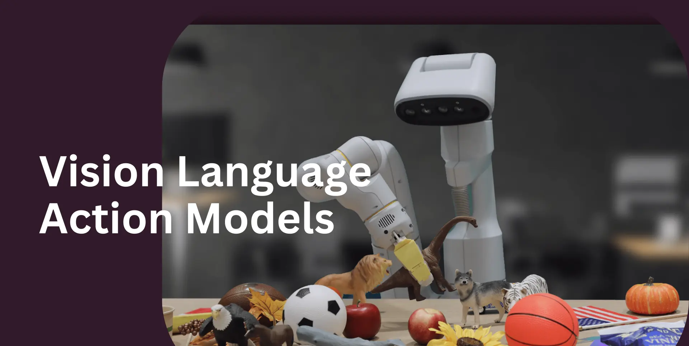

# Vision-Language-Action (VLA) Models: Replication & Deployment

This repository documents Yumao Liu’s hands-on study, replication, and deployment of key Vision-Language-Action (VLA) models in simulated environments, including:
- **VoxPoser**
- **OpenVLA**
- **Pi0**

My aim is to understand and benchmark state-of-the-art embodied AI systems capable of generalizing from language and visual input to real-world actions. Here, I present key insights, replication experiences, deployment guides, and reproducible results for each model.

   

## What are Vision-Language-Action Models?

Vision-Language-Action (VLA) models are neural architectures that jointly process images (vision) and text (language) to generate goal-directed actions, enabling general-purpose robotic agents. These models bridge perception, reasoning, and control, pushing the boundaries of robot generalization and instruction following.

## Covered Frameworks

| Model      | Highlights                        | Core Tech                         | Replication |
|------------|-----------------------------------|-----------------------------------|-------------|
| VoxPoser   | Language-conditioned pose prediction and planning | VLMs, motion planning | [VoxPoser/](./VoxPoser/) |
| OpenVLA    | Open vocabulary manipulation via language and vision | Transformer, CLIP        | [OpenVLA/](./OpenVLA/)   |
| Pi0        | Policy distillation from internet-scale data | Flow Matching, VLMs, MoE     | [Pi0/](./Pi0/)           |

## Repo Structure

- `VoxPoser/`, `OpenVLA/`, `Pi0/`:  
  Each folder includes:
  - `README.md`: model overview, methodology, core architecture
  - `deploy_details.md`: environment setup, step-by-step deployment guide
  - `results/`: videos from replication experiments

- `shared_notes.md`:  
  General VLA reading notes, cross-framework observations, and research reflections.

## Why this project?

- Demonstrates ability to deeply understand, reproduce, and deploy cutting-edge VLA models.
- Provides practical reference for those seeking to run or extend SOTA embodied AI systems.
- Complements my research in robot learning, perception, and large-model generalization.

## License

This repo contains only my original documentation, scripts, and results.  
Model code and datasets referenced remain under their original licenses (see each folder for details).
